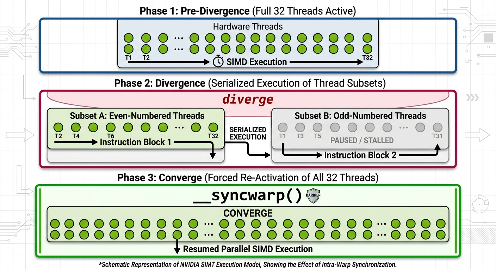

## 1. 本质区别

|指令|本质|
|---|---|
|`__syncwarp()`|**Warp 内同步（32 线程级）**|
|`__syncthreads()`|**Block 内同步（CTA 级）**|

---

## 2. 作用范围（Scope）

### 2.1 `__syncwarp()`

- **同步范围**：同一个 **warp** 内的线程
- **最大线程数**：32
- **跨 warp？** ❌ 不可能
- **是否阻塞整个 block？** ❌ 不会

### 2.2 `__syncthreads()`

- **同步范围**：同一个 **thread block（CTA）** 内的所有线程
- **线程数**：`blockDim.x × blockDim.y × blockDim.z`
- **跨 block？** ❌ 不可能
- **是否阻塞整个 block？** ✅ 会

---

## 3. 硬件机制层

### 3.1 SM 与 Warp Scheduler 工作原理

一个 SM（Streaming Multiprocessor）上同时驻留多个 warp（Occupancy 决定上限）。SM 内部有 **2~4 个 Warp Scheduler**，每个 Scheduler 每周期从 ready warp 队列中选取一个 warp 发射指令。

**`__syncthreads()` 的代价来源：**

1. 执行到 `__syncthreads()` 的线程标记自身为 **"arrived"**
2. 屏障硬件（Barrier Unit）等待 block 内**所有** warp 均到达
3. 在等待期间，该 block 占用的所有 warp slot **不可被其他 block 使用**
4. 若 block 内某 warp 因访存延迟尚未到达，其余已到达的 warp **全部 stall**

这意味着 `__syncthreads()` 不仅阻塞调用线程，还会**拖慢整个 block 的吞吐**，SM 的 latency hiding 能力在此期间部分失效。

**`__syncwarp()` 的代价来源：**

仅需等待同一 warp 内 32 条线程对齐执行点，不涉及跨 warp 的屏障硬件，开销约为数个时钟周期。

### 3.2 Volta 之前：隐式锁步执行（≤ Pascal）

Kepler / Maxwell / Pascal 架构下，同一 warp 内的 32 条线程共享**单一 Program Counter（PC）** 和 **单一调用栈**，在没有分支的情况下严格锁步执行。

**后果**：warp 内操作天然同步，warp 内读写共享内存**无需**显式 `__syncwarp()`（但写后读仍需谨慎）。

### 3.3 Volta 及之后：Independent Thread Scheduling

Volta（sm_70）引入 **per-thread PC** 和 **per-thread call stack**，每条线程拥有独立的执行上下文。

硬件变化：

|项目|≤ Pascal|≥ Volta|
|---|---|---|
|PC 数量|1 per warp|1 per thread|
|调用栈|1 per warp|1 per thread|
|warp 内线程是否可乱序|❌|✅|
|warp 内隐式同步|有（锁步）|❌ 无|

**关键推论**：Volta 之后，warp 内线程可以暂停、重排、局部前进，任何依赖隐式锁步的 warp 内共享内存操作**必须显式加 `__syncwarp()`**，否则为未定义行为。

### 3.4 Warp Divergence 与 Converge 时机

当 warp 内线程在条件分支处发生 diverge：

1. 硬件将 warp 拆分为多个 **执行子集（execution mask）**
2. 各子集串行执行各自分支
3. 分支结束后，warp **重新 converge**（所有线程重新激活）

**关键问题**：Volta 之后，converge 的时机不再保证在分支汇合点立即发生，调度器可能延迟 converge 以优化吞吐。`__syncwarp()` 的作用之一正是**强制 converge**，使 warp 内所有活跃线程对齐到该同步点。


> 【图 1】三层状态图：分支前（全 32 线程 active）→ diverge（两个执行子集串行）→ `__syncwarp()` 强制 converge（重新全激活）

---

## 4. 语义与行为差异

### 4.1 `__syncthreads()`

```cpp
__syncthreads();
```

语义：

- **所有线程必须执行到这里**，否则死锁
- 同时保证：控制同步（所有线程到齐）+ 共享内存可见性

等价于：

> "block 内的所有线程，在此形成一个**硬同步屏障**"

### 4.2 `__syncwarp()`

```cpp
__syncwarp();       // mask 默认为当前 warp 的 active mask
__syncwarp(mask);   // 显式指定参与同步的线程集合
```

语义：

- **只同步 warp 内指定 mask 的线程**
- 不要求 warp 外线程参与，不影响其他 warp

等价于：

> "warp 内这些线程，在此重新对齐执行点"

⚠️ mask 不一致 → **未定义行为**

---

## 5. `__syncwarp` 深入

### 5.1 `mask` 参数的精确语义

`mask` 是一个 32-bit 无符号整数，第 $i$ 位为 1 表示 lane $i$ 参与本次同步。语义要求：

1. **对称性**：若 lane $i$ 的 mask 中 bit $j$ 为 1，则 lane $j$ 的 mask 中 bit $i$ 也必须为 1
2. **完备性**：mask 中标记的所有线程都必须真实执行到 `__syncwarp(mask)` 这条指令
3. **活跃性**：mask 中不得包含已 exited 或 diverged-away 的线程

违反上述任意一条均为**未定义行为（UB）**。

### 5.2 Active Mask vs. Convergence Mask

**Active Mask**：当前时刻 warp 中正在执行的线程集合，由 `__activemask()` 返回。

**Convergence Mask**：语义上"应当参与同步"的线程集合，由程序员根据算法逻辑确定，通常用 `__ballot_sync()` 计算。

**错误用法（常见陷阱）：**

```cpp
// ❌ 错误：__activemask() 返回的是当前执行状态，不保证语义正确
// 若 warp 已 diverge，active mask 可能不完整
unsigned mask = __activemask();
__syncwarp(mask);
```

**正确用法：**

```cpp
// ✅ 正确：__ballot_sync 本身具有同步语义，同时返回完整 convergence mask
unsigned mask = __ballot_sync(0xffffffff, condition);
if (condition) {
    __syncwarp(mask);
}
```

`__ballot_sync(0xffffffff, pred)` 要求 warp 内全部 32 条线程参与，返回所有 pred 为真的线程的 mask，且自身保证同步——这是获取 convergence mask 的推荐方式。

### 5.3 Warp-level Primitives 与 `__syncwarp` 的配合规范

CUDA 提供的 warp-level shuffle 系列函数（`__shfl_sync`、`__shfl_up_sync`、`__shfl_down_sync`、`__shfl_xor_sync`）已内置同步语义，**不需要额外调用 `__syncwarp()`**：

```cpp
// ✅ __shfl_down_sync 自带同步，无需额外 __syncwarp
int val = __shfl_down_sync(0xffffffff, x, offset);
```

需要显式 `__syncwarp()` 的典型场景是：**通过共享内存在 warp 内交换数据**（shuffle 无法覆盖的不规则访问模式）：

```cpp
int lane = threadIdx.x % 32;
shared[lane] = val;
__syncwarp();                         // 确保所有 lane 写入完成
val = shared[(lane + 1) % 32];        // 读取相邻 lane 的值
```

---

## 6. 内存模型补充

### 6.1 内存栅栏层级

|指令|作用范围|典型场景|
|---|---|---|
|`__syncwarp()`|warp 内共享内存|warp 内 smem 读写依赖|
|`__syncthreads()`|block 内共享内存|跨 warp smem 协作|
|`__threadfence_block()`|block 内所有内存（含全局）|block 内全局内存生产者/消费者|
|`__threadfence()`|device 内所有内存|跨 block 的全局内存通信|
|`__threadfence_system()`|系统级（含 CPU 可见）|Zero-copy / Unified Memory 场景|

**关键区分**：`__syncthreads()` 保证**控制同步 + smem 可见性**，但不保证全局内存可见性。若需跨 warp 传递全局内存数据，需叠加 `__threadfence_block()` 或 `__threadfence()`。

### 6.2 L1/L2/共享内存一致性模型

CUDA 的内存一致性模型为**弱一致性（Weakly Consistent）**：

- **共享内存（Shared Memory）**：SM 内一致，`__syncthreads()` / `__syncwarp()` 足以保证 block / warp 内可见性
- **L1 Cache（per-SM）**：不同 SM 之间**不共享** L1，写入 L1 不保证其他 SM 可见
- **L2 Cache（全局共享）**：所有 SM 共享，`__threadfence()` 刷新 L1 → L2，使其他 SM 可通过 L2 读到最新值
- **全局内存（HBM）**：L2 刷新后可见

**何时需要 fence：**

```cpp
// 生产者（block 0）
global_data[idx] = result;
__threadfence();           // 确保 global_data 写入对其他 block 可见
flag[0] = 1;               // 设置标志

// 消费者（block 1）
while (atomicAdd(&flag[0], 0) == 0);  // 轮询
__threadfence();           // 确保读到最新 global_data
int val = global_data[idx];
```

### 6.3 `volatile` 在 CUDA 中的语义

`volatile` 禁止编译器对该变量的访问进行缓存或重排，每次访问直接读写内存。

**与 `__threadfence` 的关系：**

- `volatile` 作用于**编译器层**：防止寄存器缓存，强制每次从内存读取
- `__threadfence` 作用于**硬件层**：控制 L1/L2 缓存的刷新顺序

两者不可互相替代。在 Volta 之后的一致性模型中，推荐使用 CUDA 的 `cuda::atomic`（C++11 原子语义）替代裸 `volatile`，语义更清晰。

---

## 7. 条件分支中的致命差异

### 7.1 `__syncthreads()`（非常危险）

```cpp
if (threadIdx.x < 16) {
    __syncthreads(); // ❌ 死锁：另外 16 条线程永远不会到达此屏障
}
```

原因：有线程没执行到屏障，block 永远等不到全部线程。

### 7.2 `__syncwarp()`（合法但需显式 mask）

```cpp
unsigned mask = __ballot_sync(0xffffffff, threadIdx.x < 16);
if (threadIdx.x < 16) {
    __syncwarp(mask); // ✅ mask 仅包含前 16 条线程，语义一致
}
```

---

## 8. 内存可见性

|指令|保证共享内存一致性|保证全局内存一致性|
|---|---|---|
|`__syncwarp()`|✅（warp 内）|❌|
|`__syncthreads()`|✅（block 内）|❌|
|`__threadfence_block()`|✅（block 内）|✅（block 内）|
|`__threadfence()`|✅（device 内）|✅（device 内）|

> 全局内存的跨 block 可见性需要 `__threadfence()`，两个同步指令均不覆盖此场景。

---

## 9. Cooperative Groups（CG）

### 9.1 设计动机

`__syncthreads()` 和 `__syncwarp()` 是隐式绑定于固定层级的同步原语，无法表达**任意子集**的同步语义。Cooperative Groups（CUDA 9+）引入显式的 group 抽象，将同步范围作为**一等公民**传递。

### 9.2 核心类型

```cpp
#include <cooperative_groups.h>
namespace cg = cooperative_groups;
```

|类型|对应范围|等价原语|
|---|---|---|
|`cg::thread_block`|整个 block|`__syncthreads()`|
|`cg::thread_block_tile<N>`|warp 内 $N$ 条线程（$N \in {4,8,16,32}$）|`__syncwarp()`|
|`cg::coalesced_group`|当前 active 线程集合|`__syncwarp(__activemask())`|
|`cg::grid_group`|整个 grid（需 Cooperative Launch）|无对应原语|

### 9.3 用法示例

**Block 级同步（替代 `__syncthreads()`）：**

```cpp
__global__ void kernel() {
    cg::thread_block block = cg::this_thread_block();
    shared[threadIdx.x] = val;
    block.sync();   // 等价于 __syncthreads()
    val = shared[threadIdx.x ^ 1];
}
```

**Warp Tile 级同步（替代 `__syncwarp()`）：**

```cpp
__global__ void warp_reduce(float* data) {
    cg::thread_block_tile<32> warp = cg::tiled_partition<32>(cg::this_thread_block());
    float val = data[threadIdx.x];
    // warp shuffle，tile 内自动同步
    for (int offset = 16; offset > 0; offset >>= 1)
        val += warp.shfl_down(val, offset);
    if (warp.thread_rank() == 0)
        data[blockIdx.x] = val;
}
```

**Grid 级同步（跨 block，需 Cooperative Launch）：**

```cpp
__global__ void grid_sync_kernel(float* data) {
    cg::grid_group grid = cg::this_grid();
    // ... 第一阶段计算
    grid.sync();    // 等待所有 block 完成第一阶段
    // ... 第二阶段计算
}

// Host 端必须使用 Cooperative Launch
void* args[] = { &data };
cudaLaunchCooperativeKernel((void*)grid_sync_kernel, gridDim, blockDim, args);
```

`grid.sync()` 要求：sm_60+、同一 kernel 内所有 block 同时在 SM 上驻留（受 Occupancy 限制），不可与普通 `cudaLaunchKernel` 混用。

### 9.4 CG 与裸原语的对比

|维度|裸原语|Cooperative Groups|
|---|---|---|
|同步范围|固定（warp / block）|任意子集，显式传递|
|可组合性|差（全局函数调用）|好（group 作为参数传递）|
|安全性|mask 易出错|编译器辅助检查|
|官方推荐|遗留代码|CUDA 9+ 新代码推荐|

---

## 10. 典型使用场景

### 10.1 何时用 `__syncwarp()`

✅ **warp-level 算法**：warp reduction、warp scan、warp shuffle、warp 内共享内存读写依赖

```cpp
int lane = threadIdx.x % 32;
shared[lane] = val;
__syncwarp();
val = shared[(lane + 1) % 32];
```

**优势**：极低开销，不阻塞其他 warp，高性能 kernel 必备。

### 10.2 何时必须用 `__syncthreads()`

✅ **跨 warp 协作**：block-level reduction、tiled GEMM、多 warp 写共享内存后统一读取

```cpp
shared[threadIdx.x] = val;
__syncthreads();   // 必须：等待所有 warp 写入完成
val = shared[threadIdx.x ^ offset];
```

任何跨 warp 的共享内存依赖，都必须使用它。

---

## 11. 工程实践与反例

### 11.1 推理引擎中 warp-level 同步的实际模式

**FlashAttention-2 的 online softmax**

FlashAttention-2 的核心在于 online softmax：每个 warp 负责一个 query tile，在 warp 内做 partial max / partial sum 的归约，不依赖 block 内其他 warp 的数据。

```cpp
// 伪代码：FA2 warp 内 online softmax 归约
float m_new = m_prev;
float l_new = 0.0f;

// 计算当前 tile 的局部 max（warp reduction）
for (int offset = 16; offset > 0; offset >>= 1)
    m_new = fmaxf(m_new, __shfl_xor_sync(0xffffffff, m_new, offset));

// rescale 历史累加值，更新 l
l_new = expf(m_prev - m_new) * l_prev + /* 当前 tile softmax 分子之和 */;

// 无需 __syncthreads()：每个 warp 独立维护自己的 (m, l, O)
```

关键点：每个 warp 独立维护 $(m, l, O)$ 三元组，warp 间**无共享内存依赖**，全程只用 `__shfl_xor_sync`（内置同步），不需要 `__syncthreads()`，这是 FA2 高效的核心来源之一。

**vLLM PagedAttention kernel**

PagedAttention 的 KV block 按 page 组织，decode 阶段每个 warp 负责一个 head 的部分 KV block。warp 内用 shuffle reduction 合并 partial softmax，再通过**共享内存**将各 warp 的结果传递给 block 内 reduction，此处需要 `__syncthreads()`。

### 11.2 常见 Bug 模式

**Bug 1：mask 计算错误**

```cpp
// ❌ 错误：__activemask() 在 diverge 后可能返回不完整 mask
if (some_condition) {
    unsigned mask = __activemask(); // 此时 warp 已 diverge，返回值不完整
    __syncwarp(mask);
    shared[lane] = val;
    __syncwarp(mask);
    val = shared[other_lane]; // 数据竞争：未同步所有写入者
}

// ✅ 正确
unsigned mask = __ballot_sync(0xffffffff, some_condition);
if (some_condition) {
    __syncwarp(mask);
    shared[lane] = val;
    __syncwarp(mask);
    val = shared[other_lane];
}
```

**Bug 2：条件分支内的 `__syncthreads()`**

```cpp
// ❌ 死锁
if (threadIdx.x % 2 == 0) {
    shared[threadIdx.x] = compute();
    __syncthreads(); // 奇数线程永远不会到达此处
}
```

**Bug 3：漏加 fence 导致的竞态**

```cpp
// ❌ 竞态：block 0 写入 global，block 1 读取，无 fence 保证顺序
// block 0:
result[0] = heavy_compute();
atomicAdd(&counter, 1);        // 计数器递增，但 result 可能还在 L1

// block 1:
while (atomicAdd(&counter, 0) < 1);
int val = result[0];           // ❌ 可能读到旧值

// ✅ 修复：block 0 写入后加 __threadfence()
result[0] = heavy_compute();
__threadfence();               // 刷新 result 到 L2，对其他 block 可见
atomicAdd(&counter, 1);
```

### 11.3 调试工具

**`compute-sanitizer`（替代旧版 `cuda-memcheck`）**

```bash
# 检测竞态条件（race condition）
compute-sanitizer --tool racecheck ./my_kernel

# 检测内存越界
compute-sanitizer --tool memcheck ./my_kernel

# 检测同步错误（非法 __syncthreads 调用）
compute-sanitizer --tool synccheck ./my_kernel
```

`synccheck` 工具可检测：

- `__syncthreads()` 在 divergent 分支中的不对称调用
- `__syncwarp()` 的 mask 不一致

---

## 12. 性能成本

|指令|成本|
|---|---|
|`__syncwarp()`|**极低（warp 内，数个时钟周期）**|
|`__syncthreads()`|**高（block 级，全 warp stall）**|

**优化原则**：

> 能用 warp 同步，绝不用 block 同步。能用 shuffle，绝不用共享内存 + 同步。

---

## 13. 面试题库

### 13.1 手写 Warp Reduction（`__shfl_down_sync`）

```cpp
// 将 warp 内 32 条线程的 val 求和，结果在 lane 0
__device__ float warp_reduce_sum(float val) {
    // 蝶形归约：stride 依次为 16, 8, 4, 2, 1
    for (int offset = 16; offset > 0; offset >>= 1)
        val += __shfl_down_sync(0xffffffff, val, offset);
    // 归约结束后，lane 0 持有完整和
    return val;
}

__global__ void reduce_kernel(const float* input, float* output, int n) {
    int idx = blockIdx.x * blockDim.x + threadIdx.x;
    float val = (idx < n) ? input[idx] : 0.0f;

    val = warp_reduce_sum(val);

    // 每个 warp 的 lane 0 将结果写入共享内存
    __shared__ float warp_sums[32]; // 最多 1024 / 32 = 32 个 warp
    int lane    = threadIdx.x % 32;
    int warp_id = threadIdx.x / 32;
    if (lane == 0) warp_sums[warp_id] = val;

    __syncthreads(); // 等待所有 warp 写入完成

    // 第一个 warp 对 warp_sums 做最终归约
    if (warp_id == 0) {
        val = (lane < (blockDim.x / 32)) ? warp_sums[lane] : 0.0f;
        val = warp_reduce_sum(val);
        if (lane == 0) atomicAdd(output, val);
    }
}
```

### 13.2 手写 Block-level Parallel Prefix Sum（Inclusive Scan）

```cpp
// Blelloch 双向扫描（up-sweep + down-sweep），block 内 inclusive scan
// 要求 blockDim.x 为 2 的幂次
// 举例：[a, b, c, d]
__global__ void block_scan(float* data, int n) {
    extern __shared__ float s[];   // 大小 = blockDim.x
    int tid = threadIdx.x;
    s[tid] = (tid < n) ? data[tid] : 0.0f;
    __syncthreads();

    // Up-sweep（归约树）
    // stride = 1，更新 tid = 1, 3：[a, a+b, c, c+d]
    // stride = 2，更新 tid = 3   ：[a, a+b, c, a+b+c+d]
    for (int stride = 1; stride < blockDim.x; stride <<= 1) {
        if ((tid + 1) % (stride << 1) == 0)
            s[tid] += s[tid - stride];
        __syncthreads();
    }

    // Down-sweep（前缀展开）
    // 根清零：[a, a+b, c, 0]
    if (tid == blockDim.x - 1) s[tid] = 0.0f; // exclusive scan 初始化
    __syncthreads();

	// stride = 2，更新 tid = 3   ：[a, 0, c, a+b]
	// stride = 1，更新 tid = 1, 3：[0, a, a+b, a+b+c]
    for (int stride = blockDim.x >> 1; stride > 0; stride >>= 1) {
        if ((tid + 1) % (stride << 1) == 0) {
            float tmp  = s[tid - stride];
            s[tid - stride] = s[tid];
            s[tid] = s[tid] + tmp;
        }
        __syncthreads();
    }

    // 转为 inclusive：每个位置 += 原值（exclusive → inclusive）
    // data = s + orig → [a, a+b, a+b+c, a+b+c+d]
    float orig = (tid < n) ? data[tid] : 0.0f;
    __syncthreads();
    if (tid < n) data[tid] = s[tid] + orig;
}
```

### 13.3 为何 FlashAttention 的 online softmax 依赖 warp-level 而非 block-level 同步

|维度|分析|
|---|---|
|算法结构|每个 warp 独立处理一个 query tile 的 $(m, l, O)$ 三元组，warp 间无数据依赖|
|归约范围|online softmax 的 max/sum 归约只需在 warp 内（32 lanes）完成，使用 `__shfl_xor_sync`|
|避免 `__syncthreads()`|block 级屏障会将所有 warp 同步停下，破坏 warp-level pipeline，降低吞吐|
|带宽收益|warp 内归约无共享内存读写，全在寄存器完成，register-only reduction 是 FA2 高吞吐的关键|

等效说明：`__syncthreads()` 会迫使快完成的 warp 等待慢完成的 warp，而 `__shfl_xor_sync` 只在本 warp 的 32 条线程间操作，天然隔离，互不干扰。

---

## 14. 总结对照表

|维度|`__syncwarp()`|`__syncthreads()`|
|---|---|---|
|同步层级|Warp|Block|
|最大线程数|32|block 内全部|
|Volta 之后是否必须|Warp 算法中是|一直是|
|条件分支安全|有条件（mask）|❌|
|性能开销|很低|高|
|跨 warp|❌|✅|
|smem 可见性|warp 内|block 内|
|全局内存可见性|❌|❌|
|CG 等价物|`thread_block_tile<32>.sync()`|`thread_block.sync()`|
|常见用途|Warp reduction / shuffle|Tiled GEMM / Block reduction|
