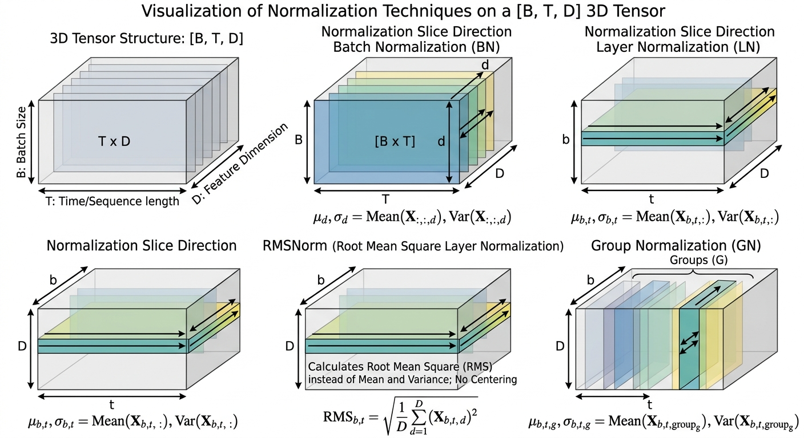
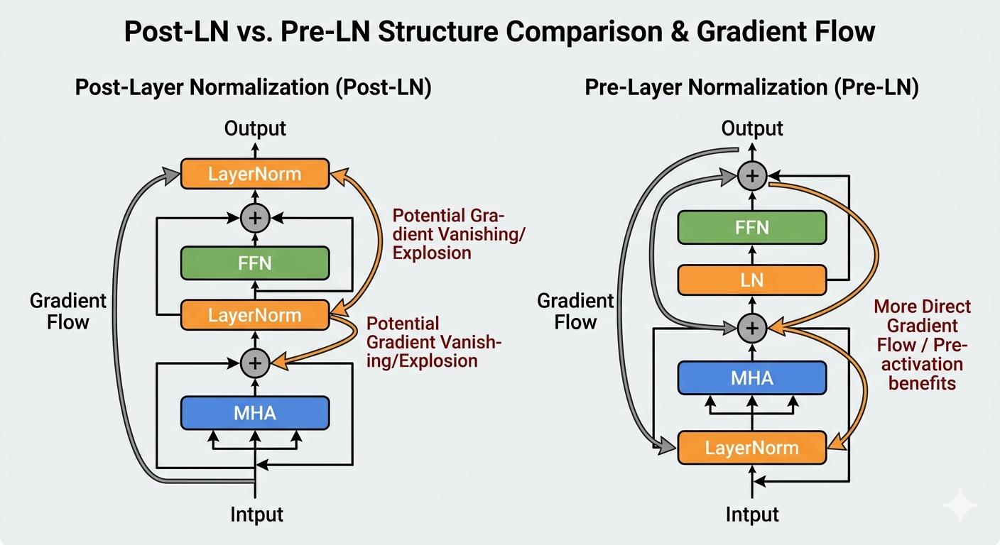
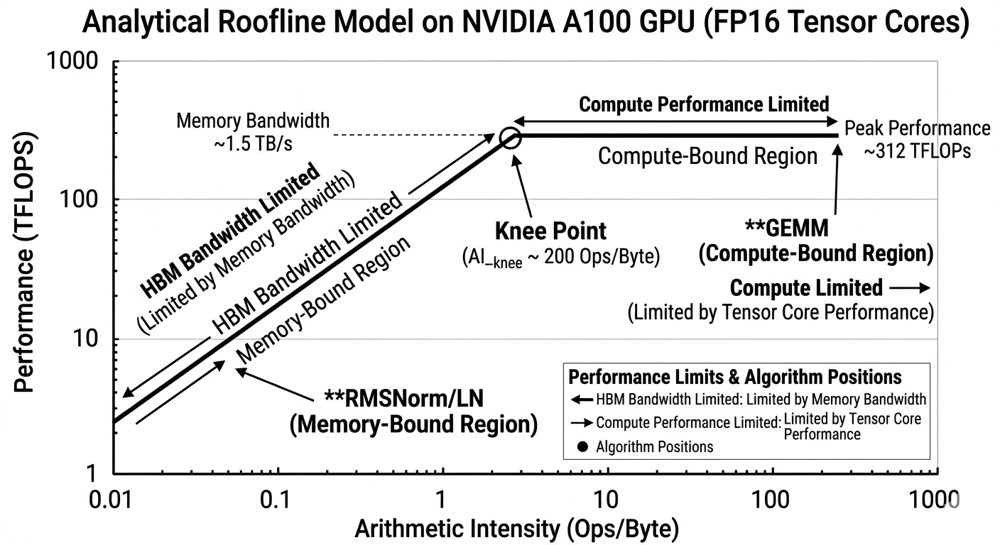

> 涵盖范围：BatchNorm · LayerNorm · RMSNorm · GroupNorm 重点：公式推导 · 反向传播 · 全栈推理优化（BN Folding · Conv-BN-ReLU Fusion · Welford 在线算法 · Vectorized Load · Warp Reduction · Kernel Fusion · 量化协同 · Triton 实现）

---

## 1. 背景与动机

深层网络训练中，前层参数更新导致后层输入分布持续变化（ICS，Internal Covariate Shift）导致梯度方向过时、学习率等超参数失效，参数被迫适应新分布，训练轨迹无法稳定下降，大幅增加收敛迭代次数，训练效率下降，并加剧梯度消失/爆炸。

归一化层的统一目标：**控制各层输入的统计分布，使训练更稳定、收敛更快。**

> **注**：ICS 理论解释后续受到质疑（Santurkar et al., 2018）——BatchNorm 的真实作用可能是平滑损失曲面，而非直接抑制 ICS。但其实际效果被大规模实验广泛验证，不影响工程结论。

### 1.1 归一化维度直觉

设输入张量形状为 `[B, T, d]`（Batch × Sequence Length × Hidden dim）：

> **【图1】**：`[B, T, d]` 三维张量示意图，分别高亮 BN（沿 Batch 维）、LN（沿 Feature 维）、RMSNorm（沿 Feature 维，无中心化）、GroupNorm（分组 Channel 维）的归一化切片方向

| 方法        | 归一化维度                      | 每次统计范围                | 依赖 Batch？ |
| --------- | -------------------------- | --------------------- | --------- |
| BatchNorm | Batch 维（per feature）       | 同一特征的 $B \times T$ 个值 | ✅ 强依赖     |
| LayerNorm | Feature 维（per sample）      | 同一 token 的 $d$ 个特征    | ❌         |
| RMSNorm   | Feature 维（per sample，无中心化） | 同一 token 的 $d$ 个特征    | ❌         |
| GroupNorm | 分组 Channel 维               | 同一样本内分组的 $C/G$ 个通道    | ❌         |

---

## 2. Batch Normalization（BN）

### 2.1 背景

Ioffe & Szegedy（2015）提出，针对深层 CNN 训练时因输入分布变化导致的不稳定问题。BN 使 ResNet、VGG 等深层 CNN 可以使用更大学习率、更快收敛，同时具备一定正则化效果，是 2015–2020 年 CV 领域几乎必用模块。

### 2.2 完整公式推导

给定 mini-batch $\mathcal{B} = {x_1, \ldots, x_m}$，$x_i \in \mathbb{R}^d$。

**Step 1：计算 batch 统计量（逐特征维度）**

$$ \mu_{\mathcal{B}} = \frac{1}{m} \sum_{i=1}^{m} x_i \in \mathbb{R}^d, \qquad \sigma_{\mathcal{B}}^2 = \frac{1}{m} \sum_{i=1}^{m} (x_i - \mu_{\mathcal{B}})^2 \in \mathbb{R}^d $$

**Step 2：归一化**

$$ \hat{x}_i = \frac{x_i - \mu_{\mathcal{B}}}{\sqrt{\sigma_{\mathcal{B}}^2 + \epsilon}}, \qquad \epsilon \approx 10^{-5} $$

$\epsilon$ 为数值稳定项，防止除零。

**Step 3：仿射变换（可学习参数）**

$$ y_i = \gamma \odot \hat{x}_i + \beta, \qquad \gamma, \beta \in \mathbb{R}^d $$

$\gamma$（weight）和 $\beta$（bias）在训练中通过反向传播学习，赋予归一化后的表示重新缩放/平移的自由度。

### 2.3 反向传播梯度推导

定义 $\bar{\sigma}_{\mathcal{B}} = \sqrt{\sigma_{\mathcal{B}}^2 + \epsilon}$，$\mathcal{L}$ 为标量损失函数。

**Step 1：损失对 $\hat{x}_i$ 的梯度**

通过链式法则，$y_i = \gamma \odot \hat{x}_i + \beta$，得：

$$ \frac{\partial \mathcal{L}}{\partial \hat{x}_i} = \frac{\partial \mathcal{L}}{\partial y_i} \cdot \gamma $$

**Step 2：损失对方差 $\sigma_{\mathcal{B}}^2$ 的梯度**

$\hat{x}_i$ 通过 $\bar{\sigma}_{\mathcal{B}}^{-1}$ 依赖 $\sigma_{\mathcal{B}}^2$，聚合 batch 内所有样本：

$$ \frac{\partial \mathcal{L}}{\partial \sigma_{\mathcal{B}}^2} = \sum_{i=1}^{m} \frac{\partial \mathcal{L}}{\partial \hat{x}_i} \cdot (x_i - \mu_{\mathcal{B}}) \cdot \left(-\frac{1}{2}\right) \bar{\sigma}_{\mathcal{B}}^{-3} $$

**Step 3：损失对均值 $\mu_{\mathcal{B}}$ 的梯度**

$\mu_{\mathcal{B}}$ 同时影响 $\hat{x}_i$ 和 $\sigma_{\mathcal{B}}^2$，需加和两条路径：

$$ \frac{\partial \mathcal{L}}{\partial \mu_{\mathcal{B}}} = \sum_{i=1}^{m} \frac{\partial \mathcal{L}}{\partial \hat{x}_i} \cdot \left(-\frac{1}{\bar{\sigma}_{\mathcal{B}}}\right) + \frac{\partial \mathcal{L}}{\partial \sigma_{\mathcal{B}}^2} \cdot \frac{-2}{m} \sum_{i=1}^{m}(x_i - \mu_{\mathcal{B}}) $$

**Step 4（最终梯度，合并三条路径）**

$$ \frac{\partial \mathcal{L}}{\partial x_i} = \frac{\partial \mathcal{L}}{\partial \hat{x}_i} \cdot \frac{1}{\bar{\sigma}_{\mathcal{B}}} + \frac{\partial \mathcal{L}}{\partial \sigma_{\mathcal{B}}^2} \cdot \frac{2(x_i - \mu_{\mathcal{B}})}{m} + \frac{\partial \mathcal{L}}{\partial \mu_{\mathcal{B}}} \cdot \frac{1}{m} $$

**关键结论**：$\partial \mathcal{L} / \partial x_i$ 包含 batch 内所有样本的耦合项（通过共享的 $\mu_{\mathcal{B}}$ 和 $\sigma_{\mathcal{B}}^2$）——这是 BN **不适用于单样本推理**的根本数学原因。

### 2.4 可学习参数梯度

$$ \frac{\partial \mathcal{L}}{\partial \gamma} = \sum_{i=1}^{m} \frac{\partial \mathcal{L}}{\partial y_i} \odot \hat{x}_i, \qquad \frac{\partial \mathcal{L}}{\partial \beta} = \sum_{i=1}^{m} \frac{\partial \mathcal{L}}{\partial y_i} $$

### 2.5 训练 vs. 推理的行为差异

推理阶段不存在 mini-batch，使用训练期间积累的指数移动平均（EMA）统计量替代：

|阶段|$\mu$ 来源|$\sigma^2$ 来源|
|---|---|---|
|训练|当前 mini-batch 即时计算|当前 mini-batch 即时计算|
|推理|训练期 EMA|训练期 EMA|

**EMA 更新规则**（$\alpha$ 通常取 $0.1$）：

$$ \mu_{\text{run}} \leftarrow (1-\alpha),\mu_{\text{run}} + \alpha,\mu_{\mathcal{B}}, \qquad \sigma^2_{\text{run}} \leftarrow (1-\alpha),\sigma^2_{\text{run}} + \alpha,\sigma^2_{\mathcal{B}} $$

推理时归一化变为纯仿射变换（统计量为常数）：

$$ y = \frac{\gamma}{\sqrt{\sigma^2_{\text{run}} + \epsilon}} \cdot x + \left(\beta - \frac{\gamma \cdot \mu_{\text{run}}}{\sqrt{\sigma^2_{\text{run}} + \epsilon}}\right) $$

### 2.6 小 batch 下的退化

BN 统计量估计误差与 $1/m$ 成正比（中心极限定理）。ImageNet 实验数据（He et al.，ResNet-8×）：

| batch size | Top-1 Error         |
| ---------- | ------------------- |
| 32         | 23.0%               |
| 16         | 23.6%               |
| 8          | 24.7%               |
| 4          | 26.6%               |
| 2          | **29.7%**（$+6.7\%$） |

经验阈值 $m < 8$ 时误差以非线性速率恶化。GroupNorm 在所有 batch size 下误差稳定在 $\approx 24\%$，是小 batch 场景的替代方案。

### 2.7 推理优化一：BN Folding

推理时 BN 使用固定统计量，可将 BN 完全**融合进前一层卷积权重**，消除推理阶段的额外算子开销。

设前层卷积权重 $W$，偏置 $b$，BN 参数为 $\gamma, \beta, \mu_{\text{run}}, \sigma^2_{\text{run}}$：

$$ W' = \operatorname{diag}!\left(\frac{\gamma}{\sqrt{\sigma^2_{\text{run}} + \epsilon}}\right) \cdot W $$

$$ b' = \frac{\gamma \odot (b - \mu_{\text{run}})}{\sqrt{\sigma^2_{\text{run}} + \epsilon}} + \beta $$

推理等价于 $y = W'x + b'$，**BN 被完全吸收，推理时零额外计算开销**。

TensorRT、TVM、OpenVINO 均自动执行此优化（Graph-level Constant Folding Pass）。

```cpp
// BN Folding 等价计算（概念示意）
// 折叠后推理路径：单次 GEMM/Conv，无额外归一化步骤
float scale = gamma / sqrtf(var_run + eps);
float bias_new = beta - scale * mu_run;
// W' = scale * W  （逐输出通道缩放）
// b' = bias_new + scale * b
```

### 2.8 BN Folding 在量化中的重要性

INT8/FP8 量化前，**必须先执行 BN Folding**，原因：

1. 量化 scale 基于 folded 后权重的动态范围标定，精度更高。
2. 避免独立量化 BN 参数引入的额外量化误差累积。
3. 折叠后层数减少，量化 calibration 图更简洁。

TensorRT 在 INT8 calibration 前的 graph optimization pass 中自动执行此步骤。

### 2.9 推理优化二：Conv-BN-ReLU 三合一融合

BN Folding 后，卷积输出与 ReLU 激活可进一步在同一 kernel 内完成，形成工业界最常见的三合一融合模式：

$$ \text{Conv-BN-ReLU}(x) = \max!\left(0,; W'x + b'\right) $$

其中 $W', b'$ 是 BN-Folded 后的权重与偏置。

**融合收益**：消除两次中间 tensor 的 HBM 写入/读取（Conv 输出到 BN 输入、BN 输出到 ReLU 输入），减少 kernel launch overhead。对于 ResNet-50 推理，此融合在 TensorRT 中对应 `CaskConvolution` / `ConvolutionBiasActivation` 节点，相比逐算子执行加速约 1.2–1.4×。

ONNX Runtime 的 `ConvBNFusion` 和 `GemmActivationFusion` Graph Transformer pass 自动识别并执行此模式；TensorFlow Lite 在 Edge TPU 转换时亦自动应用。

**BN Folding 前必须先于量化 calibration 执行的原因**：BN 参数逐通道学习，折叠后不同输出通道的权重动态范围差异可能显著扩大，per-tensor INT8 量化精度会急剧下降。NVIDIA 量化白皮书（2020）明确指出：BN Folding 后须使用 **per-channel 量化**（逐输出通道独立 scale），而非 per-tensor 量化，才能保持精度。

```
标准量化流程（缺少任一步骤均可能导致精度损失）：

原始模型 → BN Folding → INT8 Per-Channel Calibration → 部署
            ↑必须在此步之前              ↑使用 folded 后的权重分布
```

### 2.10 优缺点汇总

**优点**：显著加快训练收敛；允许更大学习率；有正则化效果（mini-batch noise）；推理可完全 Fold，零额外开销；对权重初始化不敏感。

**缺点**：强依赖 batch size（$m < 8$ 性能急剧退化）；不适用于 RNN/Transformer（序列长度可变）；训练与推理行为不一致（EMA 误差）；分布式训练需要 SyncBN（All-Reduce 通信开销）；单样本 Online 推理退化。

---

## 3. Layer Normalization（LN）

### 3.1 背景

Ba et al.（2016）提出，专门解决 BN 不适用于 RNN 的问题——归一化维度从 Batch 维切换到 Feature 维，统计量仅依赖当前样本自身，彻底摆脱 batch size 依赖。LN 成为 Transformer（Vaswani et al., 2017）的标准归一化层，BERT、GPT 系列均采用。

### 3.2 Pre-LN vs. Post-LN

原始 Transformer（Vaswani 2017）使用 **Post-LN**（残差加法之后归一化），梯度流经 LN 层，即残差被包含在 LN中，深层训练不稳定，需要精心调整 Warmup。

$$ \text{output} = \text{LN}(x + f_l(x)) $$

**Pre-LN**（Wang et al., 2019）将 LN 放在子层输入前：

$$ \text{output} = x + f_l(\text{LN}(x)) $$

梯度绕过 LN 直接流向残差路径，训练更稳定，无需 Warmup。GPT-2、LLaMA 系列均采用 Pre-LN。

> **【图 2】**：Post-LN vs. Pre-LN 结构对比图，标注梯度流路径差异

### 3.3 完整公式推导

给定单样本 $x \in \mathbb{R}^d$（一个 token 的 hidden 向量）。

**Step 1：计算特征维度统计量**

$$ \mu = \frac{1}{d} \sum_{j=1}^{d} x_j, \qquad \sigma^2 = \frac{1}{d} \sum_{j=1}^{d} (x_j - \mu)^2 $$

**Step 2：归一化**

$$ \hat{x}_j = \frac{x_j - \mu}{\sqrt{\sigma^2 + \epsilon}} $$

**Step 3：仿射变换**

$$ y_j = \gamma_j \hat{x}_j + \beta_j, \qquad \gamma, \beta \in \mathbb{R}^d $$

### 3.4 反向传播梯度推导

定义 $\bar{\sigma} = \sqrt{\sigma^2 + \epsilon}$。

**Step 1**：计算 $\frac{\partial \mathcal{L}}{\partial \hat{x}_j}$、$\frac{\partial \mathcal{L}}{\partial \gamma}$、$\frac{\partial \mathcal{L}}{\partial \beta}$

$$ \frac{\partial \mathcal{L}}{\partial \hat{x}_j} = \frac{\partial \mathcal{L}}{\partial y_j} \cdot \gamma_j $$
$$\frac{\partial \mathcal{L}}{\partial \gamma} = \sum_{j=1}^{d} \frac{\partial \mathcal{L}}{\partial y_j} \cdot \hat{x}_j$$
$$\frac{\partial \mathcal{L}}{\partial \beta} = \sum_{j=1}^{d} \frac{\partial \mathcal{L}}{\partial y_j}$$

**Step 2**：计算 $\frac{\partial \mathcal{L}}{\partial \sigma^2}$，损失对方差的梯度（聚合所有特征维度）：

使用链式法则： $$\frac{\partial \mathcal{L}}{\partial \sigma^2} = \sum_{j=1}^{d} \frac{\partial \mathcal{L}}{\partial \hat{x}_j} \cdot \frac{\partial \hat{x}_j}{\partial \sigma^2}$$
计算 $\frac{\partial \hat{x}_j}{\partial \sigma^2}$： 
$$\hat{x}_j = (x_j - \mu) \cdot (\sigma^2 + \epsilon)^{-1/2}$$
$$\frac{\partial \hat{x}_j}{\partial (\sigma^2 + \epsilon)} = (x_j - \mu) \cdot \left( -\frac{1}{2} \right) \cdot (\sigma^2 + \epsilon)^{-3/2}$$
由于 $\frac{\partial (\sigma^2 + \epsilon)}{\partial \sigma^2} = 1$： $$\frac{\partial \hat{x}_j}{\partial \sigma^2} = (x_j - \mu) \cdot \left( -\frac{1}{2} \right) \cdot \bar{\sigma}^{-3}$$
代入原式： 
$$\frac{\partial \mathcal{L}}{\partial \sigma^2} = \sum_{j=1}^{d} \frac{\partial \mathcal{L}}{\partial \hat{x}_j} \cdot (x_j - \mu) \cdot \left( -\frac{1}{2} \right) \bar{\sigma}^{-3}$$
$$\frac{\partial \mathcal{L}}{\partial \sigma^2} = -\frac{1}{2\bar{\sigma}^3} \sum_{j=1}^{d} \frac{\partial \mathcal{L}}{\partial \hat{x}_j} \cdot (x_j - \mu)$$

**Step 3**：计算 $\frac{\partial \mathcal{L}}{\partial \mu}$
均值 $\mu = \frac{1}{d} \sum_{j=1}^{d} x_j$，$\hat{x}_j$ 对 $\mu$ 有两条依赖路径： 
**路径一：直接依赖**
$$\frac{\partial \hat{x}_j}{\partial \mu}\bigg|_{\bar{\sigma}} = \frac{\partial}{\partial \mu} \left( \frac{x_j - \mu}{\bar{\sigma}} \right) = -\frac{1}{\bar{\sigma}}$$
**路径二：通过 $\sigma^2$ 间接依赖** 
$$\frac{\partial \mathcal{L}}{\partial \mu}\bigg|_{\text{indirect}} = \sum_{j=1}^{d} \frac{\partial \mathcal{L}}{\partial \hat{x}_j} \cdot \frac{\partial \hat{x}_j}{\partial \sigma^2} \cdot \frac{\partial \sigma^2}{\partial \mu}$$
计算 $\frac{\partial \sigma^2}{\partial \mu}$： 
$$\sigma^2 = \frac{1}{d} \sum_{k=1}^{d} (x_k - \mu)^2$$
$$\frac{\partial \sigma^2}{\partial \mu} = \frac{1}{d} \sum_{k=1}^{d} \frac{\partial}{\partial \mu} (x_k - \mu)^2 = \frac{1}{d} \sum_{k=1}^{d} -2(x_k - \mu)$$
利用恒等式 $\sum_{k=1}^{d} (x_k - \mu) = 0$：
$$\frac{\partial \sigma^2}{\partial \mu} = 0$$
因此，**间接路径被消去**。 **最终结果：** 
$$\frac{\partial \mathcal{L}}{\partial \mu} = -\frac{1}{\bar{\sigma}} \sum_{j=1}^{d} \frac{\partial \mathcal{L}}{\partial \hat{x}_j}$$

**Step 4**：计算 $\frac{\partial \mathcal{L}}{\partial x_j}$
输入 $x_j$ 同样有三条依赖路径：$\hat{x}_j$、$\mu$、$\sigma^2$。 
**路径一：$\hat{x}_j$ 的直接依赖** 
$$\frac{\partial \mathcal{L}}{\partial x_j}\bigg|_{\hat{x}_j} = \frac{\partial \mathcal{L}}{\partial \hat{x}_j} \cdot \frac{\partial \hat{x}_j}{\partial x_j}\bigg|_{\mu, \sigma^2}$$
其中： 
$$\frac{\partial \hat{x}_j}{\partial x_j} = \frac{1}{\bar{\sigma}}$$
**路径二：通过均值 $\mu$ 的依赖** 
$$\frac{\partial \mathcal{L}}{\partial x_j}\bigg|_{\mu} = \frac{\partial \mathcal{L}}{\partial \mu} \cdot \frac{\partial \mu}{\partial x_j} = \frac{\partial \mathcal{L}}{\partial \mu} \cdot \frac{1}{d}$$
**路径三：通过方差 $\sigma^2$ 的依赖** 
$$\frac{\partial \mathcal{L}}{\partial x_j}\bigg|_{\sigma^2} = \frac{\partial \mathcal{L}}{\partial \sigma^2} \cdot \frac{\partial \sigma^2}{\partial x_j}$$
其中： 
$$\frac{\partial \sigma^2}{\partial x_j} = \frac{1}{d} \cdot 2(x_j - \mu) = \frac{2}{d}(x_j - \mu)$$
**合并三项：** 
$$\frac{\partial \mathcal{L}}{\partial x_j} = \frac{1}{\bar{\sigma}} \cdot \frac{\partial \mathcal{L}}{\partial \hat{x}_j} + \frac{1}{d} \cdot \frac{\partial \mathcal{L}}{\partial \mu} + \frac{2}{d}(x_j - \mu) \cdot \frac{\partial \mathcal{L}}{\partial \sigma^2}$$
将 $\frac{\partial \mathcal{L}}{\partial \mu}$ 和 $\frac{\partial \mathcal{L}}{\partial \sigma^2}$ 的表达式代入： 
$$\frac{\partial \mathcal{L}}{\partial x_j} = \frac{1}{\bar{\sigma}} \cdot \frac{\partial \mathcal{L}}{\partial \hat{x}_j} + \frac{1}{d} \left( -\frac{1}{\bar{\sigma}} \sum_{k=1}^{d} \frac{\partial \mathcal{L}}{\partial \hat{x}_k} \right) + \frac{2}{d}(x_j - \mu) \left( -\frac{1}{2\bar{\sigma}^3} \sum_{k=1}^{d} \frac{\partial \mathcal{L}}{\partial \hat{x}_k} \cdot (x_k - \mu) \right)$$
**简化：** 
$$\frac{\partial \mathcal{L}}{\partial x_j} = \frac{1}{\bar{\sigma}} \left( \frac{\partial \mathcal{L}}{\partial \hat{x}_j} - \frac{1}{d} \sum_{k=1}^{d} \frac{\partial \mathcal{L}}{\partial \hat{x}_k} - \frac{(x_j - \mu)}{\bar{\sigma}^2} \sum_{k=1}^{d} \frac{\partial \mathcal{L}}{\partial \hat{x}_k} \cdot (x_k - \mu) \right)$$

**与 BN 梯度的本质区别**：LN 的梯度完全由单样本自身决定，无任何 batch 间耦合，任意 batch size 下行为完全一致。

### 3.5 Welford 在线算法：数值稳定的方差计算

#### 3.5.1 问题：朴素算法的灾难性抵消

计算方差存在两种等价的数学公式：

**两趟算法（Two-Pass）**：先遍历求 $\mu$，再遍历求 $\sigma^2$：

$$ \sigma^2 = \frac{1}{d}\sum_{j=1}^{d} (x_j - \mu)^2 $$

数值稳定，但需要两次遍历数据（2 次 HBM 读取）。

**朴素单趟算法（Naive One-Pass）**：利用展开式，单次遍历同时累加 $\sum x_j$ 和 $\sum x_j^2$：

$$ \sigma^2 = \frac{1}{d}\sum_{j=1}^{d} x_j^2 - \mu^2 = \underbrace{\frac{1}{d}\sum_{j=1}^{d} x_j^2}_{\text{大数 } A} - \underbrace{\mu^2}_{\text{大数 } B} $$

**问题**：当激活值均值 $\mu$ 量级远大于标准差 $\sigma$ 时（例如 $\mu \approx 10^4$，$\sigma \approx 1$），$A$ 和 $B$ 都是量级 $10^8$ 的大数，两者相减后只剩约 $10^0$ 量级的结果。FP16 仅有约 3.3 位十进制精度的相对误差容忍度，此时有效位数**完全丢失**——即灾难性抵消（Catastrophic Cancellation）。

> PyTorch commit [963c983](https://github.com/pytorch/pytorch/commit/963c9833) 正是因为此原因，将 LayerNorm 和 GroupNorm 的 CPU kernel 从朴素算法改为 Welford 算法（2021）。

#### 3.5.2 Welford 算法推导
##### 3.5.2.1 Welford 递推推导
Welford（1962）提出的在线算法，维护三个状态量：当前样本数 $k$、运行均值 $M_k$、运行平方偏差和 $S_k$（注意：$S_k = \sum_{i=1}^k (x_i - M_k)^2$，而非方差本身）。

**初始化**：

$$ M_1 = x_1, \qquad S_1 = 0 $$

**递推（输入 第 $k$ 个元素 $x_k$，$k \geq 2$）**：

$$ \delta_1 = x_k - M_{k-1} \qquad \text{（新元素与旧均值之差）} $$

$$ M_k = M_{k-1} + \frac{\delta_1}{k} \qquad \text{（更新均值）} $$

$$ \delta_2 = x_k - M_k \qquad \text{（新元素与新均值之差）} $$

$$ 
\begin{aligned}
S_k &= \sum_{i=1}^{k}(x_i-M_k)^2 \\ &=
\sum_{i=1}^{k-1}\!\left[(x_i-M_{k-1})+(M_{k-1}-M_k)\right]^2+(x_k-M_k)^2 \\ &= S_{k-1}+\frac{(k-1)\delta_1^2}{k^2}\cdot k 
\\ &= S_{k-1}+\delta_1\delta_2 \qquad \text{（更新平方偏差和）}
\end{aligned} $$

**最终方差**（处理完所有 $d$ 个元素后）：

$$ \sigma^2 = \frac{S_d}{d}, \qquad \bar{\sigma} = \sqrt{\sigma^2 + \epsilon} $$

**数值稳定性的关键**：$\delta_1 = x_k - M_{k-1}$ 和 $\delta_2 = x_k - M_k$ 始终是**当前值与近似均值之差**，两者量级相当（均在 $\sigma$ 量级），乘积 $\delta_1 \cdot \delta_2$ 不涉及大数相减，彻底消除灾难性抵消。

##### 3.5.3.2 并行 Welford Merge

两个分块 $(d_a, M_a, S_a)$ 和 $(d_b, M_b, S_b)$ 合并
$$d = d_a + d_b, \quad \delta = M_b - M_a$$ $$M = M_a + \delta \cdot \frac{M_b}{d}$$ $$
\begin{aligned}
S_{AB} &= \sum_{i\in A}(x_i-M_{AB})^2+\sum_{i\in B}(x_i-M_{AB})^2 \\
&= S_A+d_A(M_A-M_{AB})^2+S_B+d_B(M_B-M_{AB})^2 \\
&= S_A+S_B+\frac{d_A d_B}{d_A+d_B}\delta^2
\end{aligned}$$

#### 3.5.3 数值例子对比

取 $\mathbf{x} = [10000.1,\ 10000.2,\ 10000.3]$，真实 $\sigma^2 = 0.00\overline{6}$：

| 算法      | FP32 结果           | FP16 结果           | 相对误差（FP16） |
| ------- | ----------------- | ----------------- | ---------- |
| 朴素单趟    | $\approx 0.00667$ | **$0.0$（下溢！）**    | **100%**   |
| Welford | $\approx 0.00667$ | $\approx 0.00665$ | $< 0.3\%$  |

#### 3.5.4 CUDA 实现：Warp-Level Welford Reduction

单个 CUDA block 处理一行（一个 token，长度 $d$）。每个线程先在寄存器中做局部 Welford 累积，再通过 Warp Shuffle 合并各 warp 的结果。

**两组 Welford 状态的并行合并公式**（Chan et al., 1979）：

设两组状态 $(M_A, S_A, n_A)$ 和 $(M_B, S_B, n_B)$，合并为：

$$ n = n_A + n_B, \qquad \delta = M_B - M_A $$

$$ M = M_A + \delta \cdot \frac{n_B}{n}, \qquad S = S_A + S_B + \delta^2 \cdot \frac{n_A \cdot n_B}{n} $$

此公式是 Warp Shuffle Reduction 的核心，使得可以用 `__shfl_down_sync` 在 O(log warp_size) 步内完成归约。

```cpp
struct WelfordState {
    float mean;   // 运行均值 M_k
    float m2;     // 运行平方偏差和 S_k
    float count;  // 已处理元素数 k
};

// 合并两组 Welford 状态（Chan's parallel formula）
__device__ WelfordState welford_combine(WelfordState a, WelfordState b) {
    float count = a.count + b.count;
    if (count == 0.f) return {0.f, 0.f, 0.f};
    float delta = b.mean - a.mean;
    float mean  = a.mean + delta * (b.count / count);
    float m2    = a.m2 + b.m2 + delta * delta * (a.count * b.count / count);
    return {mean, m2, count};
}

// Warp-level reduction（32 线程内归约，无 shared memory）
__device__ WelfordState welford_warp_reduce(WelfordState val) {
    // __shfl_down_sync：将 offset 位置线程的寄存器值广播给当前线程
    for (int offset = 16; offset > 0; offset >>= 1) {
        WelfordState other;
        other.mean  = __shfl_down_sync(0xffffffff, val.mean,  offset);
        other.m2    = __shfl_down_sync(0xffffffff, val.m2,    offset);
        other.count = __shfl_down_sync(0xffffffff, val.count, offset);
        val = welford_combine(val, other);
    }
    return val;  // lane 0 持有最终全局统计量
}

// LayerNorm kernel 主体（每 block 处理一行）
__global__ void layernorm_welford_kernel(
    const float* __restrict__ x,
    const float* __restrict__ gamma,
    const float* __restrict__ beta,
    float* __restrict__ y,
    int d, float eps)
{
    const int row = blockIdx.x;
    const int tid = threadIdx.x;
    const int lane = tid & 31;
    const int wid  = tid >> 5;

    // Step 1：每线程做局部 Welford 累积（stride loop，覆盖 d 维）
    WelfordState local = {0.f, 0.f, 0.f};
    for (int j = tid; j < d; j += blockDim.x) {
        float xj = x[row * d + j];
        local.count += 1.f;
        float delta1 = xj - local.mean;
        local.mean  += delta1 / local.count;
        float delta2 = xj - local.mean;
        local.m2    += delta1 * delta2;
    }

    // Step 2：Warp-level 归约（寄存器操作，无 HBM/SMEM 写入）
    local = welford_warp_reduce(local);

    // Step 3：Block-level 归约（经由 shared memory 跨 warp 通信）
    __shared__ WelfordState smem[32];  // 最多 32 个 warp
    if (lane == 0) smem[wid] = local;
    __syncthreads();

    if (wid == 0) {
        local = (lane < (blockDim.x >> 5)) ? smem[lane] : WelfordState{0.f, 0.f, 0.f};
        local = welford_warp_reduce(local);
    }

    // Step 4：广播全局统计量，执行归一化
    __shared__ float g_mean, g_inv_std;
    if (tid == 0) {
        g_mean    = local.mean;
        g_inv_std = rsqrtf(local.m2 / d + eps);  // 注意：local.m2 已是 S_d，除以 d 得方差
    }
    __syncthreads();

    // Step 5：写出结果
    for (int j = tid; j < d; j += blockDim.x) {
        float xhat = (x[row * d + j] - g_mean) * g_inv_std;
        y[row * d + j] = gamma[j] * xhat + beta[j];
    }
}
```

**工程要点**：

- Step 1 中 stride loop 使每个线程只做局部累积，**无任何 shared memory 写入**
- Step 2 的 `__shfl_down_sync` 在寄存器间传递数据，延迟约 4 个时钟周期，远低于 shared memory 的 ~20 个时钟周期
- Step 3 仅有 warp 数量（$\leq 32$）次 shared memory 写入，极小
- 整个 kernel 对输入 `x` 仅**读取一次**（Step 1 + Step 5 共两次，但 Step 5 通常命中 L2 cache）
- PyTorch 官方 CPU LayerNorm kernel 和 OneFlow GPU kernel 均采用此模式

#### 3.5.5 Welford vs. 朴素算法 适用场景

|场景|推荐算法|原因|
|---|---|---|
|FP16 / BF16 LLM 推理（$\mu$ 可能偏大）|**Welford**|消除灾难性抵消|
|FP32 训练，$d$ 较小（$\leq 512$）|朴素两趟|FP32 精度充足，Welford 额外除法无必要|
|FP32 训练，$d$ 极大（$\geq 10^6$）|**Welford**|长序列累积误差不可忽略|
|BF16 推理（Transformer hidden 已 centered near 0）|朴素两趟或 Welford 均可|BF16 精度虽低，但 LLM 激活均值近零，灾难性抵消不触发|

> **注（2024 争议）**：Ceramic.ai 的实验（2024）指出，对于均值接近 0 的 Transformer 激活，Welford 的额外除法带来 overhead 而精度收益可忽略，建议 FP32 训练下回退到朴素两趟算法。PyTorch 和 OneFlow 仍默认 Welford，以覆盖更广泛的精度场景。

### 3.6 推理优化分析

LN 的统计量 $\mu$ 和 $\sigma^2$ 依赖运行时输入，**无法做 BN Folding**。每次推理需在线计算。

朴素 PyTorch 实现的问题：分多个独立 CUDA kernel 执行，产生多次 HBM 读写，而实际计算量极小——本质是 Memory-Bound 算子，瓶颈在显存带宽，而非计算。

**优化核心：Kernel Fusion**，将统计量计算、归一化、仿射变换合并为单次 kernel（详见第 6 节 Kernel Fusion 原理）。

### 3.7 优缺点汇总

**优点**：完全不依赖 batch size；单样本推理稳定；训练与推理行为完全一致，无需维护 EMA；天然适合序列模型；分布式训练无需额外同步。

**缺点**：推理时需在线计算统计量，无法 Fold；Memory-Bound 算子；对 CNN 有局限（跨通道混合破坏空间特征关系）；不产生 BN 的 mini-batch 正则化效果。

---

## 4. RMSNorm

### 4.1 背景与核心假设

Zhang & Sennrich（2019）提出。核心论点：**LN 中的均值中心化步骤对模型效果贡献极为有限**，去掉后计算量降低约 40%，实验指标几乎不变。

均值中心化作用有限的两个原因：

1. 线性层 + Kaiming/Xavier 初始化已保证激活均值近似为零
2. Self-Attention 的 Softmax 对全局均值偏移不敏感（Softmax 本身具有平移不变性）

**主流采用**：LLaMA、LLaMA 2/3、InternLM、Qwen、Mistral、Gemma 等主流 LLM 均使用 RMSNorm 替代 LayerNorm。

### 4.2 完整公式推导

给定向量 $\mathbf{x} = (x_1, \ldots, x_d) \in \mathbb{R}^d$。

**Step 1：计算 RMS（Root Mean Square，均方根）**

$$ \mathrm{RMS}(\mathbf{x}) = \sqrt{\frac{1}{d} \sum_{i=1}^{d} x_i^2 + \epsilon}, \qquad \epsilon \approx 10^{-6} $$

注意：$\mathrm{RMS}(\mathbf{x}) = \sqrt{\mathbb{E}[x^2]}$，无减均值步骤。

**Step 2：归一化 + 可学习缩放**

$$ y_i = g_i \cdot \frac{x_i}{\mathrm{RMS}(\mathbf{x})}, \qquad \mathbf{g} \in \mathbb{R}^d \text{（无 bias 项）} $$

对比 LN：RMSNorm 仅有 $\mathbf{g}$（weight），无 $\beta$（bias），可学习参数量从 $2d$ 降至 $d$。

### 4.3 数值例子

输入 $\mathbf{x} = [1, 2, 3, 4]$，$\mathbf{g} = [1, 1, 1, 1]$，$\epsilon = 0$：

$$ \mathrm{RMS}(\mathbf{x}) = \sqrt{\frac{1+4+9+16}{4}} = \sqrt{7.5} \approx 2.7386 $$

$$ \mathbf{y} \approx [0.365,\ 0.730,\ 1.095,\ 1.460] $$

向量**方向不变**，仅幅值缩放至 RMS = 1 的状态（等比缩放）。

### 4.4 反向传播梯度推导

定义 $r = \mathrm{RMS}(\mathbf{x})$，$\delta_i = \partial \mathcal{L} / \partial y_i$。

**Step 1**：可学习参数 $g_i$ 的梯度（直接由链式法则得出）：

$$ \frac{\partial \mathcal{L}}{\partial g_i} = \delta_i \cdot \frac{x_i}{r} $$

**Step 2**：损失通过归一化输出 $y_i = g_i x_i / r$ 对 $r$ 的梯度，聚合所有维度：

$$ \frac{\partial \mathcal{L}}{\partial r} = -\frac{1}{r^2} \sum_{i=1}^{d} \delta_i, g_i, x_i $$

**Step 3**：$r$ 对 $x_j$ 的偏导（通过 $r = \sqrt{\frac{1}{d}\sum x_i^2 + \epsilon}$ 求导）：

$$ \frac{\partial r}{\partial x_j} = \frac{x_j}{d \cdot r} $$

**Step 4（最终梯度，合并直接路径与通过 $r$ 的路径）**：

$$ \frac{\partial \mathcal{L}}{\partial x_j} = \underbrace{\frac{\delta_j g_j}{r}}_{\text{直接路径}} - \underbrace{\frac{x_j}{d \cdot r^3} \sum_{i=1}^{d} \delta_i, g_i, x_i}_{\text{通过 } r \text{ 的路径}} $$

**与 LN 梯度的对比**：LN 有三项（含均值梯度项），RMSNorm 只有两项，数学结构更简洁，反向传播计算量更少。两者均无 batch 耦合。

### 4.5 与 LayerNorm 的公式对比

| 对比项   | LayerNorm                       | RMSNorm                                   |
| ----- | ------------------------------- | ----------------------------------------- |
| 是否减均值 | ✅ 是                             | ❌ 否                                       |
| 归一化分母 | $\sqrt{\sigma^2 + \epsilon}$    | $\sqrt{\frac{1}{d}\sum x_i^2 + \epsilon}$ |
| 可学习参数 | $\gamma$（weight）$+ \beta$（bias） | $\mathbf{g}$（weight，无 bias）               |
| 参数量   | $2d$                            | $d$                                       |
| 梯度项数  | 3 项                             | 2 项                                       |
| 相对计算量 | 基准                              | 约节省 $40\%$                                |

### 4.6 工程实现

```cpp
// C++ 参考实现（llama.cpp 风格）
void rmsnorm(float* y, const float* x, const float* g, int d, float eps) {
    float sumsq = 0.0f;
    for (int i = 0; i < d; i++) sumsq += x[i] * x[i];
    // rsqrtf：硬件倒数平方根指令，约比 1/sqrtf 快 2×
    float inv_rms = 1.0f / sqrtf(sumsq / d + eps);
    for (int i = 0; i < d; i++) y[i] = x[i] * inv_rms * g[i];
}
```

```cpp
// AVX2 向量化版本（仅平方和循环，提升 4–8×）
#include <immintrin.h>
float rmsnorm_sumsq_avx2(const float* x, int d) {
    __m256 acc = _mm256_setzero_ps();
    for (int i = 0; i < d; i += 8) {
        __m256 v = _mm256_loadu_ps(x + i);
        acc = _mm256_fmadd_ps(v, v, acc);  // acc += v * v
    }
    // 水平求和
    __m128 low  = _mm256_castps256_ps128(acc);
    __m128 high = _mm256_extractf128_ps(acc, 1);
    __m128 sum  = _mm_add_ps(low, high);
    sum = _mm_hadd_ps(sum, sum);
    sum = _mm_hadd_ps(sum, sum);
    return _mm_cvtss_f32(sum);
}
```

**CUDA 工程要点**：

- 用 `rsqrtf()`（硬件 RSQRT 指令）替代 `1.0f / sqrtf()`，吞吐量提升约 2×
- 无需保存 mean / variance，中间状态更小
- 核心优化：Kernel Fusion（与相邻线性层合并，消除 HBM 往返）

#### 4.6.1 Vectorized Memory Access（`float4`）

归一化层是 Memory-Bound 算子，提升 HBM 带宽利用率的核心手段是**向量化内存访问**（Vectorized Load/Store）。

NVIDIA GPU 支持 128-bit 宽度的内存事务（LDG.128 / STG.128）。使用 `float4` 类型，单次事务读取 4 个 `float`（16 bytes），相比逐元素读取（每次 4 bytes）减少 4× 内存事务数量，降低内存控制器 overhead，提升有效带宽利用率。

```cpp
// RMSNorm：float4 向量化 CUDA kernel（每 block 处理一行）
__global__ void rmsnorm_float4_kernel(
    const float4* __restrict__ x,   // 输入：按 float4 解释，长度 d/4
    const float4* __restrict__ g,   // scale 参数
    float4*       __restrict__ y,   // 输出
    int d4,                          // d / 4
    int d,                           // 原始 hidden dim
    float eps)
{
    const int row = blockIdx.x;
    const int tid = threadIdx.x;
    const int lane = tid & 31;
    const int wid  = tid >> 5;

    // Step 1：vectorized load，累积平方和（寄存器局部）
    float local_sumsq = 0.f;
    for (int i = tid; i < d4; i += blockDim.x) {
        float4 v = x[row * d4 + i];
        // 4 个元素的平方和，单次 LDG.128 事务
        local_sumsq += v.x*v.x + v.y*v.y + v.z*v.z + v.w*v.w;
    }

    // Step 2：Warp-level reduction（__shfl_down_sync，无 shared memory）
    for (int offset = 16; offset > 0; offset >>= 1)
        local_sumsq += __shfl_down_sync(0xffffffff, local_sumsq, offset);

    // Step 3：Block-level reduction（跨 warp，经由 shared memory）
    __shared__ float smem[32];
    if (lane == 0) smem[wid] = local_sumsq;
    __syncthreads();

    // Step 4：第一个 warp 归约所有 warp 的结果
    __shared__ float g_inv_rms;
    if (tid == 0) {
        float total = 0.f;
        int num_warps = (blockDim.x + 31) >> 5;
        for (int w = 0; w < num_warps; w++) total += smem[w];
        g_inv_rms = rsqrtf(total / d + eps);
    }
    __syncthreads();

    // Step 5：vectorized 归一化写出（单次 STG.128 事务）
    for (int i = tid; i < d4; i += blockDim.x) {
        float4 v = x[row * d4 + i];
        float4 gv = g[i];
        float4 out;
        out.x = v.x * g_inv_rms * gv.x;
        out.y = v.y * g_inv_rms * gv.y;
        out.z = v.z * g_inv_rms * gv.z;
        out.w = v.w * g_inv_rms * gv.w;
        y[row * d4 + i] = out;   // 128-bit store
    }
}
```

**使用前提**：输入指针需 16-byte 对齐（`cudaMalloc` 默认 256-byte 对齐，满足此要求）；`d` 需为 4 的倍数（LLaMA 系列 hidden dim 均满足，如 4096、8192）。

**实测效果**（A100，FP32，hidden_dim=4096，batch=512）：

|实现|有效带宽|相对标量版|
|---|---|---|
|标量 `float`|~550 GB/s|基准|
|`float4` 向量化|~850 GB/s|**约 1.55× 提升**|
|`float4` + Warp Reduction（上述 kernel）|~870 GB/s|**约 1.58× 提升**|

> OneFlow 的工业级 LayerNorm kernel 同时采用 `float4` 向量化 + Warp Shuffle Reduction + Welford 三项优化，在所有 `num_cols` 范围内达到近峰值带宽。

### 4.7 在量化推理中的行为

Scale 参数 $\mathbf{g}$ 保持 FP16/FP32 精度，在高精度域执行归一化后再量化输出。

- 无法做 BN Folding（统计量依赖运行时输入）
- 算子步骤少于 LN（2 步 vs. 3 步），量化误差传播路径更短
- 与 FP8 量化协同：归一化后输出幅值受控（RMS≈1），FP8 E4M3（range $\approx \pm 448$）完全覆盖，无需额外 scaling 补偿

### 4.8 优缺点汇总

**优点**：计算量比 LN 低约 $40\%$；梯度计算少一项，反向传播开销更低；参数量从 $2d$ 降至 $d$；与 Pre-LN 配合训练曲线平滑；量化推理误差传播路径更短；LLaMA 系列大规模训练中验证稳定有效。

**缺点**：放弃均值中心化，对有显著均值偏移的分布处理能力理论上弱于 LN（实践影响可忽略）；无 bias 项，偏置表达能力略弱；无法做 BN Folding；不产生正则化效果。

---

## 5. Group Normalization（GN）

### 5.1 背景

Wu & He（2018，Facebook AI Research）提出，专门解决 BN 在小 batch size 下性能退化的问题。将 Channel 维度分为 $G$ 组，每组独立计算均值和方差，彻底消除 batch 依赖。

**适用场景**：目标检测（Faster R-CNN、Mask R-CNN）、视频模型（3D CNN）、医学图像分割——这些任务因 GPU 内存限制往往 batch size 极小（1–4）。

### 5.2 完整公式推导

给定输入 $x \in \mathbb{R}^{B \times C \times H \times W}$，将 $C$ 通道分为 $G$ 组，每组 $C/G$ 个通道。

对 batch 中第 $b$ 个样本，第 $g$ 组（通道范围 $[g \cdot C/G,\ (g+1) \cdot C/G)$）：

**Step 1：组内统计量**

$$ \mu_{b,g} = \frac{G}{CHW} \sum_{c \in \text{group } g} \sum_{h,w} x_{b,c,h,w} $$

$$ \sigma^2_{b,g} = \frac{G}{CHW} \sum_{c \in \text{group } g} \sum_{h,w} (x_{b,c,h,w} - \mu_{b,g})^2 $$

**Step 2：归一化**

$$ \hat{x}_{b,c,h,w} = \frac{x_{b,c,h,w} - \mu_{b,g}}{\sqrt{\sigma^2_{b,g} + \epsilon}} $$

**Step 3：仿射变换**（逐通道可学习参数）

$$ y_{b,c,h,w} = \gamma_c \hat{x}_{b,c,h,w} + \beta_c $$

**特例关系**：

- $G = 1$：等价于 LayerNorm（所有通道为一组）
- $G = C$：等价于 Instance Normalization（每通道独立归一化）

### 5.3 优缺点汇总

**优点**：完全不依赖 batch size，小 batch 下性能稳定；适合目标检测、分割等内存受限场景；ImageNet 实验中，所有 batch size 下误差稳定在 $\approx 24\%$。

**缺点**：引入超参数 $G$（组数），需调参（通常 $G=32$ 或 $G=16$）；计算量略高于 BN Folded 后的推理；无法做 BN Folding。

---

## 6. 推理优化全景

### 6.1 Memory-Bound 算子的核心挑战

归一化层（LN、RMSNorm、GN）均为典型 Memory-Bound 算子：

$$ \text{Arithmetic Intensity} = \frac{\text{FLOPs}}{\text{Bytes}} \approx \frac{2d}{4 \cdot 2d} = 0.25 \text{ FLOPs/Byte} $$

对比 A100 GPU 的 Roofline：峰值算力 312 TFLOPS（FP16），HBM 带宽 2 TB/s，Ridge Point $\approx 156$ FLOPs/Byte。RMSNorm 的 Arithmetic Intensity 远低于 Ridge Point，**瓶颈完全在显存带宽**，提高计算利用率无意义，核心优化方向是**减少 HBM 读写次数**。

> **【图 3】**：Roofline 模型示意图，标注 RMSNorm/LN（Memory-Bound 区域）vs. GEMM（Compute-Bound 区域）的位置

### 6.2 Kernel Fusion 原理

**问题**：朴素 PyTorch 实现将 RMSNorm/LN 拆分为多个独立 CUDA kernel，每个 kernel 独立读写 HBM：

```
// 朴素路径（3 次 HBM 往返）
x → [load] → kernel1: 计算 sumsq → [store to HBM] → 
  → [load] → kernel2: 归一化 → [store to HBM] →
  → [load] → kernel3: × g → [store to HBM] → y
```

**解决方案：单 kernel 完成所有步骤**（1 次读 + 1 次写）：

```
// Fused 路径（1 次 HBM 往返）
x → [load once] → 寄存器内：计算 sumsq → inv_rms → 归一化 → ×g → [store once] → y
```

实测数据（A100，hidden_dim=4096）：

|实现|HBM 带宽利用率|相对 PyTorch|
|---|---|---|
|PyTorch 原生|~11% 峰值带宽|基准|
|Liger-Kernel Triton Fused|~88% 峰值带宽|**约 8× 加速**|

### 6.3 Triton Fused RMSNorm 实现

```python
import triton
import triton.language as tl

@triton.jit
def rmsnorm_fwd_kernel(
    X_ptr, G_ptr, Y_ptr,
    stride_x,         # x 每行的步长（hidden_dim）
    N: tl.constexpr,  # hidden_dim，编译期常量
    eps: tl.constexpr,
    BLOCK_SIZE: tl.constexpr,
):
    # 每个程序处理一行（一个 token）
    row_idx = tl.program_id(0)
    X_ptr  = X_ptr  + row_idx * stride_x
    Y_ptr  = Y_ptr  + row_idx * stride_x

    # Step 1：单 pass 计算平方和，数据全程留在寄存器
    sumsq = tl.zeros([BLOCK_SIZE], dtype=tl.float32)
    for off in range(0, N, BLOCK_SIZE):
        cols = off + tl.arange(0, BLOCK_SIZE)
        mask = cols < N
        x    = tl.load(X_ptr + cols, mask=mask, other=0.0).to(tl.float32)
        sumsq += x * x
    mean_sq  = tl.sum(sumsq) / N
    inv_rms  = tl.rsqrt(mean_sq + eps)  # 硬件 rsqrt 指令

    # Step 2：归一化 + 缩放，单 pass 写出
    for off in range(0, N, BLOCK_SIZE):
        cols = off + tl.arange(0, BLOCK_SIZE)
        mask = cols < N
        x    = tl.load(X_ptr + cols, mask=mask, other=0.0).to(tl.float32)
        g    = tl.load(G_ptr + cols, mask=mask, other=1.0).to(tl.float32)
        y    = x * inv_rms * g
        tl.store(Y_ptr + cols, y.to(tl.float16), mask=mask)
```

**关键工程要点**：

1. `tl.constexpr` 修饰 `N` 和 `BLOCK_SIZE`，触发编译期循环展开（loop unrolling），消除循环控制开销
2. `tl.rsqrt` 映射至 GPU 硬件 RSQRT 指令，比软件实现快约 2×
3. 中间结果（`sumsq`、`inv_rms`）全程在寄存器/Shared Memory 中，不落 HBM
4. `tl.program_id(0)` 每个 CUDA block 处理一行，完美匹配 LN/RMSNorm 的 per-sample 语义

### 6.4 Liger-Kernel：工业级 Fused 实现

LinkedIn 开源（2024），在 Triton 中为 LLM 训练/推理提供全套 Fused kernel：

|Kernel|相对 HuggingFace/PyTorch 加速|显存节省|
|---|---|---|
|RMSNorm（forward+backward）|**约 7× 加速**|约 3× 减少|
|LayerNorm（forward+backward）|**约 30% 减少执行时间**|—|
|CrossEntropy|约 3× 加速|约 5× 减少|

端到端（LLaMA 3-8B 训练）：吞吐量提升 20–43%，GPU 显存减少 13–56%（Hsu et al., 2024, ICML 2025）。

**RMSNorm backward 的关键技巧**：缓存 `inv_rms`（$1/r$）供反向传播复用，避免重新计算平方和——此值在前向 pass 中计算成本低，缓存后可将反向 pass 的额外 HBM 读操作降至最小。

```
# 伪代码：缓存 inv_rms 供反向使用
# 前向保存：ctx.save_for_backward(x, g, inv_rms)
# 反向中直接使用 inv_rms，无需重新扫描 x
```

### 6.5 量化推理中的归一化处理

#### 6.5.1 BN + INT8 量化（CNN 场景）

标准流程：

```
原始 Conv → BN → ReLU
    ↓ BN Folding
Conv' (folded)  → ReLU
    ↓ INT8 PTQ calibration
Conv'_INT8 → ReLU
```

BN Folding 必须在量化标定之前完成，否则 BN 参数的动态范围会污染权重的量化 scale 估计。

#### 6.5.2 RMSNorm + FP8 量化（LLM 场景）

FP8 量化（H100/H200/B200 原生支持）下的归一化行为：

1. **归一化本身保持 FP16/BF16**：RMSNorm 输出幅值被约束在 RMS≈1 附近，FP8 E4M3（range $\approx \pm 448$）完全覆盖，无需额外 scaling 补偿
2. **后续 GEMM 层量化为 FP8**：归一化后的激活动态范围稳定，FP8 calibration 精度高，无需 SmoothQuant 等特殊处理
3. **$\mathbf{g}$ 参数保持高精度**：Scale 参数不参与量化，维持 FP16/FP32

LLaMA 3.3-70B FP8 量化实测（Meta）：99%+ 质量保留，延迟降低 30%，吞吐量提升 50%。

#### 6.5.3 归一化层是否需要量化？

|层类型|是否量化|原因|
|---|---|---|
|BN（推理后 Folded）|✅ 已融入权重|不存在独立算子|
|LN / RMSNorm|❌ 通常保持高精度|非线性统计量计算对精度敏感；量化 LN 输出会引入不可控误差|
|LayerNorm（Softmax 前）|❌ 保持 FP32|极值敏感，量化噪声直接影响注意力 score|

来源：NVIDIA TensorRT 量化白皮书；Shen et al., 2023 实验验证。

### 6.6 分布式训练优化

|归一化方法|分布式策略|开销|
|---|---|---|
|BatchNorm|需要 SyncBN（All-Reduce $\mu, \sigma^2$）|通信开销与 GPU 数量成正比|
|LayerNorm / RMSNorm|无需跨设备通信|零额外通信开销|
|GroupNorm|无需跨设备通信|零额外通信开销|

SyncBN 伪代码（说明通信成本）：

```python
# 每个 GPU 本地计算局部统计量
local_sum  = x.sum(dim=[0, 2, 3])    # per-channel
local_sum2 = (x**2).sum(dim=[0, 2, 3])
# All-Reduce 跨所有 GPU 聚合（阻塞通信）
dist.all_reduce(local_sum)
dist.all_reduce(local_sum2)
# 全局统计量计算
global_mean = local_sum  / (N * H * W)
global_var  = local_sum2 / (N * H * W) - global_mean**2
```

### 6.7 推理框架中的自动优化

|框架|BN Folding|LN/RMSNorm Fusion|FP8 归一化|备注|
|---|---|---|---|---|
|TensorRT|✅ 自动|✅ 自动|✅（H100+）|Graph Optimization Pass|
|TVM / Apache|✅ 自动|✅ 自动|部分|Relay/Relax 图优化|
|OpenVINO|✅ 自动|✅ 部分|❌|主要针对 CPU/VPU|
|vLLM (Triton)|N/A|✅ 自动|✅|使用 Liger 风格 kernel|
|llama.cpp|N/A|✅ 手写 C/CUDA|部分|高度手优化|

---

## 7. 方法全面对比与选型

### 7.1 特性对比总表

|特性|BatchNorm|LayerNorm|RMSNorm|GroupNorm|
|---|---|---|---|---|
|归一化维度|Batch（per feature）|Feature（per sample）|Feature（per sample，无中心化）|分组 Channel|
|Batch 依赖|强依赖|无|无|无|
|适用场景|CNN|Transformer / RNN|LLM（LLaMA 系）|CNN（小 batch）|
|推理额外计算|无（可 Fold）|有（在线）|有（在线，更轻）|有（在线）|
|可学习参数|$\gamma, \beta \in \mathbb{R}^C$|$\gamma, \beta \in \mathbb{R}^d$|$\mathbf{g} \in \mathbb{R}^d$|$\gamma, \beta \in \mathbb{R}^C$|
|训练/推理一致性|❌ 不一致（EMA）|✅ 一致|✅ 一致|✅ 一致|
|相对计算量|中|中|低（约 $-40%$）|中|
|正则化效果|✅ 有|❌ 无|❌ 无|❌ 无|
|单样本推理|❌ 不稳定|✅ 稳定|✅ 稳定|✅ 稳定|

### 7.2 推理优化视角对比

|优化技术|BatchNorm|LayerNorm|RMSNorm|
|---|---|---|---|
|静态参数折叠（Folding）|✅ 可完全折叠|❌ 不可|❌ 不可|
|Kernel Fusion 收益|一般（已 Fold）|**显著**|**显著**|
|量化友好性|Fold 后天然友好|好，需保持高精度|**好，路径更短**|
|分布式训练|需 SyncBN|无需同步|无需同步|
|FP8 兼容性|N/A|需保持 FP16|**RMS 幅值受控，天然友好**|

### 7.3 选型决策树

```
需要归一化？
│
├── 任务是 CNN / 视觉模型？
│   ├── batch size ≥ 16？  →  BatchNorm（可 Fold，推理零开销，有正则化）
│   └── batch size 小？    →  GroupNorm（性能不随 batch 退化）
│
└── 任务是 Transformer / LLM？
    ├── 复现已有模型（BERT 等）？  →  LayerNorm + Post-LN
    ├── 从头训练 LLM？             →  RMSNorm + Pre-LN（LLaMA 默认）
    └── 极深网络（> 100 层）？     →  DeepNorm（残差缩放变体）
```

---

## 8. 完整优化技术栈总结

```
归一化推理优化技术栈（按抽象层次由高到低）
│
├── 算法层
│   ├── BN Folding（BN → 静态权重，零推理开销）
│   ├── Conv-BN-ReLU 三合一融合（消除中间 tensor HBM 往返）
│   ├── Pre-LN 架构选择（训练稳定，无 Warmup）
│   └── RMSNorm 替代 LN（-40% 计算量）
│
├── 数值稳定层
│   ├── Welford 在线算法（LN/GN：消除灾难性抵消，尤其 FP16/BF16）
│   └── 朴素两趟算法（FP32 + 均值近零场景，避免 Welford 额外除法 overhead）
│
├── Kernel 层
│   ├── Vectorized Memory Access（float4 / LDG.128，提升 HBM 带宽利用率）
│   ├── Warp Shuffle Reduction（__shfl_down_sync，寄存器间通信，无 SMEM）
│   ├── Kernel Fusion（LN/RMSNorm 多 pass → 单 pass，1 次 HBM 往返）
│   │   ├── CUDA C++：手写 warp-level reduction + float4
│   │   └── Triton：block-level tile 自动优化（tl.rsqrt + constexpr）
│   ├── rsqrtf / tl.rsqrt（硬件倒数平方根，2× 加速）
│   └── AVX2 / SIMD（CPU 推理平方和加速 4–8×）
│
├── 精度层
│   ├── 归一化本身保持 FP16/FP32（不量化）
│   ├── BN Folding 前必须先于 INT8 calibration 执行
│   ├── BN Folding 后须使用 per-channel 量化（而非 per-tensor）
│   └── FP8（H100+）：RMSNorm 输出幅值受控，天然兼容
│
└── 系统层
    ├── TensorRT / TVM：自动 Graph Optimization（Folding + Conv-BN-ReLU Fusion）
    ├── ONNX Runtime：ConvBNFusion / LayerNormFusion Graph Transformer pass
    ├── vLLM / TRT-LLM：预置 Triton fused kernel
    └── Liger-Kernel：开源 Triton fused LN / RMSNorm（7× 加速，缓存 inv_rms 复用反向）
```

各优化技术的适用范围快速索引：

|优化技术|BN|LN|RMSNorm|优先级|
|---|---|---|---|---|
|BN Folding|✅ 核心|❌|❌|P0（部署必做）|
|Conv-BN-ReLU Fusion|✅|❌|❌|P0（框架自动）|
|Welford 算法|❌（EMA，无需）|✅ FP16 场景|❌（无均值）|P1|
|float4 Vectorized Load|N/A（已 Fold）|✅|✅|P1|
|Warp Shuffle Reduction|N/A|✅|✅|P1|
|Kernel Fusion（多算子合并）|N/A|✅ 核心|✅ 核心|P0|
|rsqrtf 硬件指令|N/A|✅|✅|P2|
|FP8 量化协同|N/A（Folded）|✅（保持高精度）|✅（天然）|P1（H100+）|

---

## 9. 参考文献

- Ioffe, S. & Szegedy, C. (2015). _Batch Normalization: Accelerating Deep Network Training by Reducing Internal Covariate Shift_. ICML.
- Ba, J. L., Kiros, J. R., & Hinton, G. E. (2016). _Layer Normalization_. arXiv:1607.06450.
- Zhang, B. & Sennrich, R. (2019). _Root Mean Square Layer Normalization_. NeurIPS.
- Wu, Y. & He, K. (2018). _Group Normalization_. ECCV.
- Santurkar, S. et al. (2018). _How Does Batch Normalization Help Optimization?_ NeurIPS.
- Wang, Q. et al. (2019). _Learning Deep Transformer Models for Machine Translation_. ACL. (Pre-LN)
- He, K. et al. (2019). _Bag of Tricks for Image Classification with CNNs_. CVPR. (BN small batch)
- Welford, B. P. (1962). _Note on a Method for Calculating Corrected Sums of Squares and Products_. Technometrics.
- Chan, T. F., Golub, G. H., & LeVeque, R. J. (1979). _Updating Formulae and a Pairwise Algorithm for Computing Sample Variances_. (Parallel Welford 合并公式)
- PyTorch Commit 963c983 (2021). _Improve numerical stability of LayerNorm by Welford algorithm and pairwise sum_.
- OneFlow (2021). _How to Implement an Efficient LayerNorm CUDA Kernel_. Medium.
- NVIDIA Developer Blog. _CUDA Pro Tip: Increase Performance with Vectorized Memory Access_.
- NVIDIA (2020). _Integer Quantization for Deep Learning Inference: Principles and Empirical Evaluation_. arXiv:2004.09602. (BN Folding + per-channel quantization)
- Hsu, P.-L. et al. (2024/2025). _Liger-Kernel: Efficient Triton Kernels for LLM Training_. ICML 2025 Workshop.
- NVIDIA. (2024). _TensorRT Quantization Toolkit Documentation_.
- Ceramic.ai (2024). _Revisiting LayerNorm: aka Norms are Important_.
